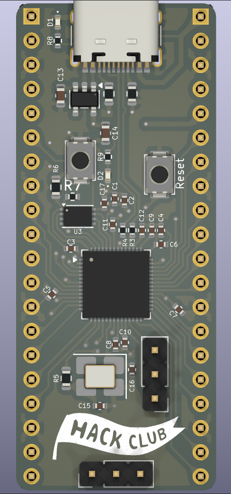
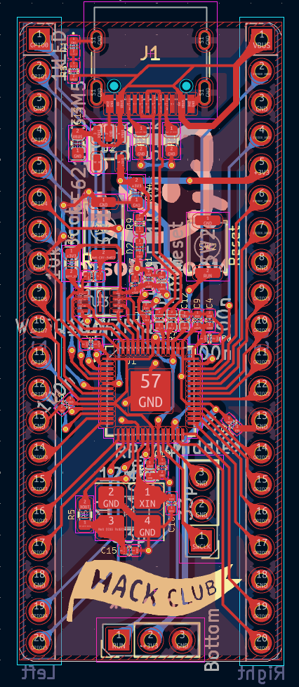
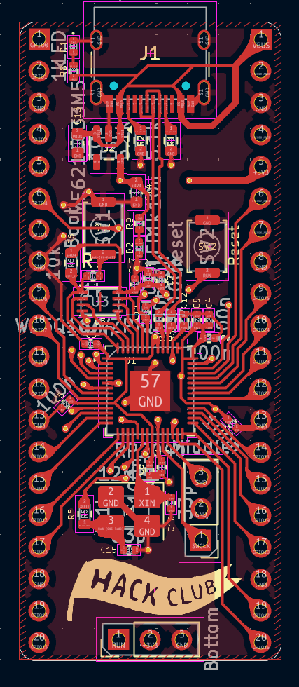
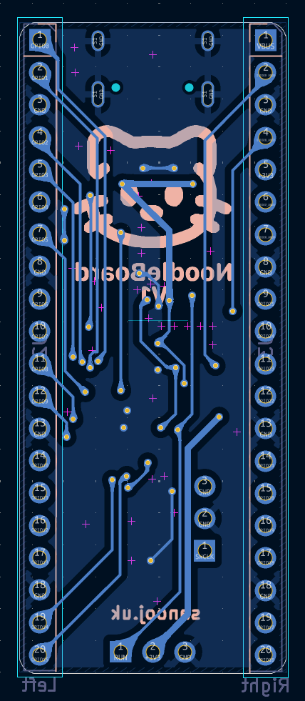
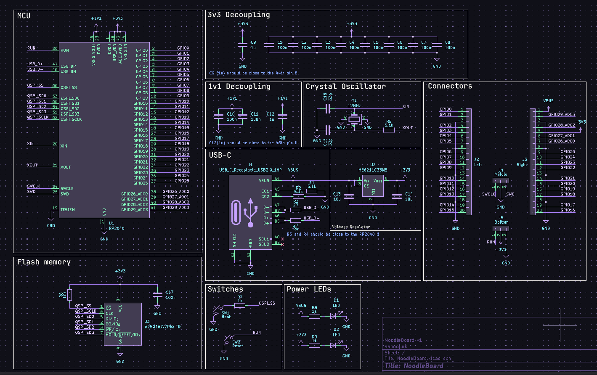

# NoodleBoard

A simple Development Board using RP2040 created by following the
[Guide](https://blueprint.hackclub.com/starter-projects/devboard) and adding
some personal magic

## PCB

Images of PCB

 

## BOM (Bill of materials)

| Qty     | Item                     | Desc            | Size               | Link                                                                                                               |
| ------- | ------------------------ | --------------- | ------------------ | ------------------------------------------------------------------------------------------------------------------ |
| 11x     | 0.1uF(100nF)             | Capacitor       | 0402(1005Metric)   | Link                                                                                                               |
| 2x      | 1uF(1000nF)              | Capacitor       | 0402(1005Metric)   | Link                                                                                                               |
| 2x      | 10uF                     | Capacitor       | 0603(1608Metric)   | Link                                                                                                               |
| 2x      | 33pF                     | Capacitor       | 0402(1005Metric)   | Link                                                                                                               |
| 4x      | 1k Ohm                   | Resistor        | 0402(1005Metric)   | Link                                                                                                               |
| 2x      | 5.1k Ohm                 | Resistor        | 0603(1608Metric)   | Link                                                                                                               |
| 2x      | 27 Ohm                   | Resistor        | 0402(1005Metric)   | Link                                                                                                               |
| 2x      | 10k Ohm                  | Resistor        | 0603(1608Metric)   | Link                                                                                                               |
| 2x      | 16-213SDRC/S530-A3/TR8   | Red LED         | 0402(1005Metric)   | [Link](https://jlcpcb.com/partdetail/EverlightElec-16_213SDRC_S530_A3TR8/C71911)                                   |
| 1x      | RP2040                   | Microcontroller | QFN-56-1EP         | [Link](https://jlcpcb.com/partdetail/RaspberryPi-RP2040/C2040)                                                     |
| 1x      | ME6211C33M5G-N           | LDO Regulator   | SOT-23-5           | [Link](https://jlcpcb.com/partdetail/84106-ME6211C33M5GN/C82942)                                                   |
| 1x      | W25Q16JVZPIQ             | Flash           | Winbond_USON-8-1EP | [Link](https://jlcpcb.com/partdetail/WinbondElec-W25Q16JVZPIQ/C377853)                                             |
| 1x      | 12MHz                    | Crystal         | 3225 4Pin          | [Link](https://jlcpcb.com/partdetail/YXC_CrystalOscillators-X322512MSB4SI/C9002)                                   |
| 2x      | TS-1088-AR02016          | Switches        | SPST_NO_Alps_SKRK  | [Link](https://jlcpcb.com/partdetail/XUNPU-TS_1088AR02016/C720477)                                                 |
| 1x      | USBC Female              | USBC Connector  | TYPE-C-31-M-12     | [Link](https://jlcpcb.com/partdetail/Korean_HropartsElec-TYPE_C_31_M12/C165948)                                    |
| 46 (1x) | Pin Header Vertical Male | Pin Headers     | 2.54mm             | [Link](https://robu.in/product/2-54mm-2x40-pin-male-double-row-straight-long-header-strip/?utm_source=chatgpt.com) |
